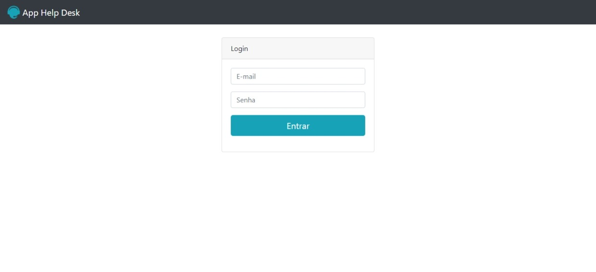

# App_help_desk

O Objetivo desse app o usuario faz um login para ter acesso as paginas restritas da autenticação ao se autenticar
o usuario podera abrir um chamado ao abrir o chamado o usuario poderá consultar os chamados que ele solicitou
nessa apliçação existe tambem um controle de perfil de acesso o usuário autenticado so vera os chamados
que ele abriu outro lado postivo dessa aplicação e a segurança do lado do back-end

## tela de login 

##Tecnologias utilizadas

* php
* bootstrap
* html
